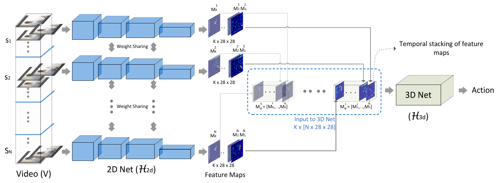
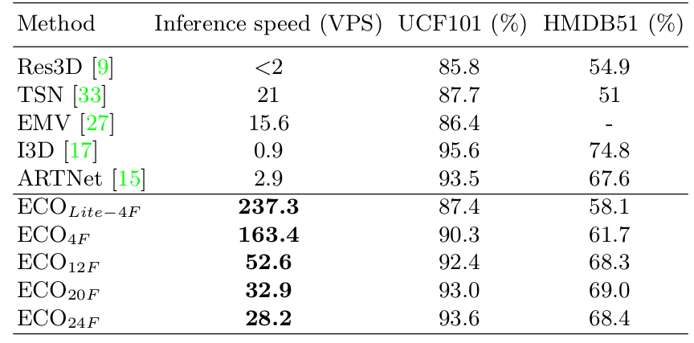
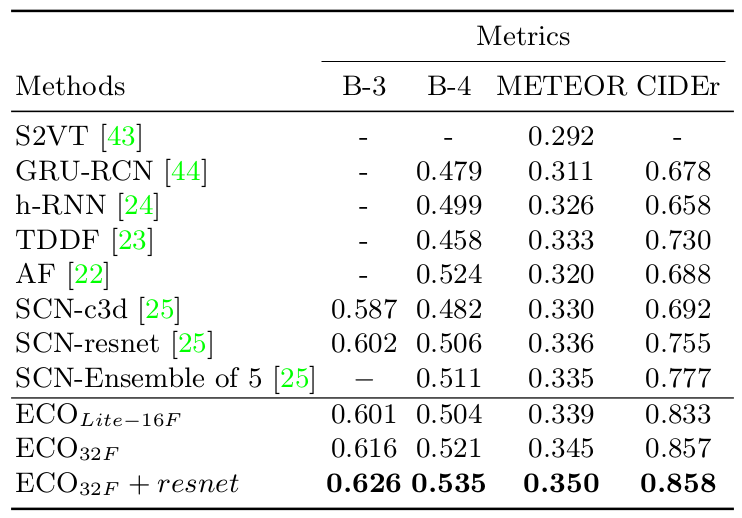
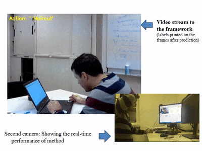

#### Code and models of [paper](https://arxiv.org/pdf/1804.09066.pdf). " ECO: Efficient Convolutional Network for Online Video Understanding, European Conference on Computer Vision (ECCV), 2018." 
 By Mohammadreza Zolfaghari, Kamaljeet Singh, Thomas Brox


### Update
- **2018.8.01**: Scripts for online recognition and video captioning
- **2018.7.30**: Adding codes and models
- **2018.4.17**: Repository for ECO.


### Introduction
This repository will contains all the required models and scripts for the paper [ECO: Efficient Convolutional Network for Online Video Understanding](https://arxiv.org/pdf/1804.09066.pdf).




In this work, we introduce a network architecture that takes long-term content into account and enables fast per-video processing at the same time. The architecture is based on merging long-term content already in the network rather than in a post-hoc fusion. Together with a sampling strategy, which exploits that neighboring frames are largely redundant, this yields high-quality action classification and video captioning at up to 230 videos per second, where each video can consist of a few hundred frames. The approach achieves competitive performance across all datasets while being 10x to 80x faster than state-of-the-art methods.


### Results 
Action Recognition on UCF101 and HMDB51           |  Video Captioning on MSVD dataset
:-------------------------:|:-------------------------:
  |  

### Online Video Understanding Results 
Model trained on UCF101 dataset             |  Model trained on Something-Something dataset
:-------------------------:|:-------------------------:
  |  

### Requirements
1. Requirements for `Python`
2. Requirements for `Caffe` (see: [Caffe installation instructions](http://caffe.berkeleyvision.org/installation.html))

### Installation
##### Build Caffe
We used the following configurations with cmake:
- Cuda 8
- Python 3
- Google protobuf 3.1
- Opencv 3.2

    ```Shell
    cd $caffe_3d/
    mkdir build && cd build
    cmake .. 
    make && make install
    ```

### Usage

*After successfully completing the [installation](#installation)*, you are ready to run all the following experiments.

### Data list format
	```
        /path_to_video_folder number_of_frames video_label
	```
### Training
1. Download the initialization and trained models:

	```Shell
        sh download_models.sh
	```
 
2. Train ECO Lite on kinetics dataset:
 
	
        sh models_ECO_Lite/kinetics/run.sh
	
 
 
 
### TODO
1. Data
2. Tables and Results
3. Demo
4. PyTorch version of ECO


### Citation
If you use this code or ideas from the paper for your research, please cite our paper:
```
@inproceedings{ECO_eccv18,
author={Mohammadreza Zolfaghari and
               Kamaljeet Singh and
               Thomas Brox},
title={{ECO:} Efficient Convolutional Network for Online Video Understanding},	       
booktitle={ECCV},
year={2018}
}
```

### Contact

  [Mohammadreza Zolfaghari](https://github.com/mzolfaghari/ECO_efficient_video_understanding)

  Questions can also be left as issues in the repository. We will be happy to answer them.
